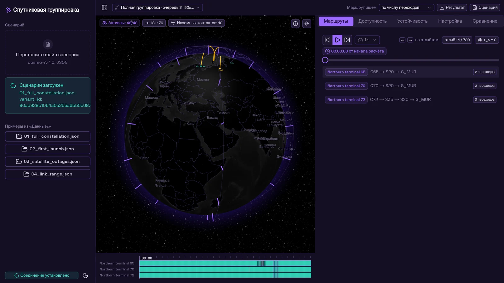
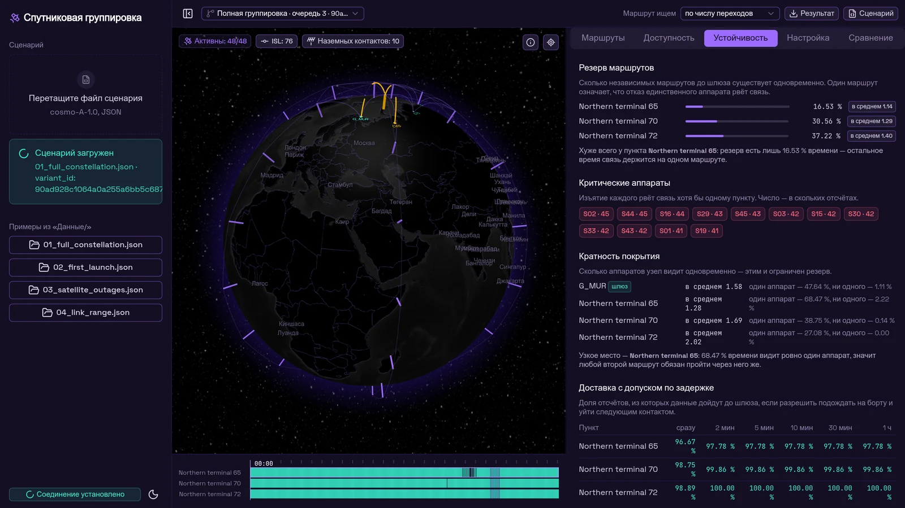
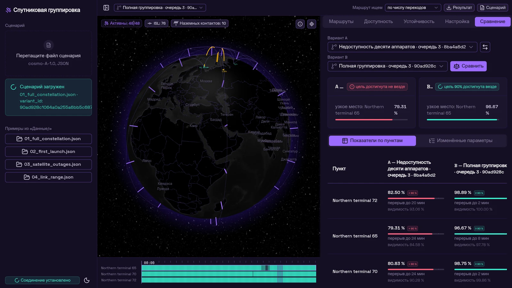
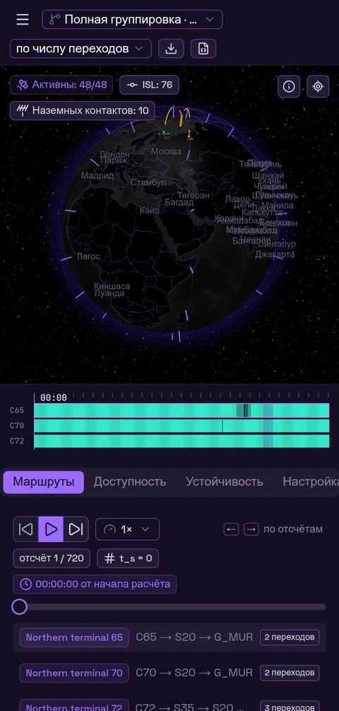

# Проектирование устойчивой спутниковой группировки

Веб-сервис для инженера-проектировщика: загрузить сценарий группировки, менять конфигурацию,
считать сквозные маршруты «наземный пункт → спутники → шлюз», сравнивать варианты и получать
обоснованные рекомендации. Целевой ориентир — доступность связи **не менее 90 % расчётного времени
по каждому клиентскому пункту**.

Кейс А КосмоХакатона-2026.

**Демо: [braining.space](https://braining.space)**



---

## Запуск

```bash
docker compose up --build
```

Открыть **http://localhost:8000**. Один образ, один процесс, один порт: FastAPI отдаёт собранный
фронтенд и держит единственный эндпоинт `/ws`. Образ поднимается на машине, где нет ни Python,
ни Node — шрифты, текстуры глобуса и география лежат внутри, интернет не нужен.

Если исходники не нужны, сервис поднимается готовым образом из Docker Hub одной строкой:

```bash
docker run -d -p 8000:8000 oligovit6/constellation:latest
```

<details>
<summary>Запуск готового образа из реестра — без исходников</summary>

Если собирать не нужно, достаточно образа: в нём уже лежат собранный фронтенд, расчётное ядро,
сэмплы сценариев, шрифты и текстуры глобуса.

```bash
docker run -d -p 8000:8000 oligovit6/constellation:latest
```

Либо через compose, чтобы сохранённые варианты конфигурации пережили перезапуск:

```bash
CONSTELLATION_IMAGE=oligovit6/constellation:latest \
  docker compose -f docker-compose.hub.yml up -d
```

Опубликован образ под `linux/amd64`: тег `latest` и тег по хешу коммита, из которого он собран.
На Apple Silicon запускается через эмуляцию. Нативный `linux/arm64` собирается тем же скриптом,
если на хосте зарегистрирован эмулятор и есть несколько ГБ свободного диска:

```bash
docker run --privileged --rm tonistiigi/binfmt --install arm64   # один раз
docker login && tools/publish-image.sh oligovit6                 # обе архитектуры
```

Одну архитектуру публикует `CONSTELLATION_PLATFORMS=linux/amd64 tools/publish-image.sh oligovit6`.

</details>

<details>
<summary>Запуск без Docker — для тех, кто правит код</summary>

```bash
# терминал 1 — бэкенд
pip install -r backend/requirements-dev.txt
cd backend && uvicorn app.main:app --reload --port 8000

# терминал 2 — фронтенд
cd frontend && npm ci && npm run dev
```

Фронтенд возьмёт `/ws` с текущего origin; если бэкенд на другом порту — задайте
`NUXT_PUBLIC_WS_URL`.

</details>

---

## Требования

Для запуска одной командой нужен только **Docker с Compose v2** — ни Python, ни Node на машине
не требуются, всё собирается внутри образа.

| Что | Версия | Зачем |
|---|---|---|
| Docker + Compose v2 | любая актуальная | `docker compose up --build`, единственный обязательный путь |
| Python | **3.10+** (проверено на 3.12) | только для правки бэкенда и прогона тестов |
| Node.js | **22** | только для правки фронтенда (`nuxt dev`) |

Образ собирается на `node:22-alpine` и `python:3.12-slim`, теги базовых образов зафиксированы.

Зависимости бэкенда — `backend/requirements.txt`: `fastapi>=0.115`, `uvicorn[standard]>=0.30`,
`numpy>=2.0`. Тестовые вынесены отдельно в `backend/requirements-dev.txt` (`pytest`, `websockets`,
`httpx`), в образ не попадают. Фронтенд — Nuxt 4 с Nuxt UI v4, `globe.gl` и Tailwind 4,
версии закреплены в `frontend/package-lock.json`.

Порт по умолчанию — **8000**, переопределяется переменной `CONSTELLATION_PORT` при запуске из
реестра. Интернет после скачивания образа не нужен: шрифты, текстуры глобуса и география лежат
внутри.

---

## Что попробовать за две минуты

1. Нажмите пример **`01_full_constellation.json`** в панели слева. Сценарий уходит на сервер,
   считается весь суточный горизонт и приезжает **одним пакетом**.
2. **Проведите мышью по полосе суток внизу.** Глобус идёт за курсором без единого запроса к
   серверу: все 720 отсчётов уже в памяти браузера. Мятное на полосе — маршрут есть, фиолетовое —
   спутник виден, но сети до шлюза нет, тёмное — нет и спутника. Перерывы видно сразу, искать их
   перетаскиванием не нужно.
3. Вкладка **«Устойчивость» → «Посчитать»**: сколько независимых маршрутов существует
   одновременно, какие аппараты рвут связь поимённо, чем ограничен резерв.
4. Вкладка **«Настройка»**: переключите очередь запуска на первую, сохраните вариант.
5. Вкладка **«Сравнение»**: выберите два сохранённых варианта — сервис скажет, какой предпочесть
   и при каком условии.
6. Переключатель **«Маршрут ищем»** в шапке: по числу переходов или по длине трассы. Доступность
   не изменится ни на сотую — она свойство сети, а не алгоритма. Изменятся длина маршрута и число
   переходов.
7. Подсуньте заведомо битый JSON — ошибка придёт с именем проблемного поля, а не трейсбеком.

---

## Что здесь сделано не как у всех

### Сутки целиком вместо ползунка

Обычный таймлайн заставляет искать перерывы перетаскиванием и платит запросом к серверу за каждый
момент. Здесь весь горизонт приезжает одним бинарным пакетом (**718 КБ** на вариант: позиции
720×48×3 float32, рёбра CSR-массивом), поэтому перемотка идёт со скоростью движения курсора и **не
делает ни одного запроса**. Полоса суток показывает сразу все 720 отсчётов по каждому пункту.

Насечки над полосой — период повторения межспутниковой топологии. Он не подобран на глаз:
сдвиг на **половину периода обращения** переводит каждый аппарат в антипод (`r(t+T/2) = −r(t)`,
численно 6.9·10⁻¹² км), а расстояния между парами при этом сохраняются — значит топология точно
периодична с T/2 = 47.75 мин для орбиты 550 км. Доказательство и замеры — [`docs/MODEL.md`](docs/MODEL.md).

### Анализ устойчивости, которого нет в обязательных показателях



Доступность говорит «путь есть». Сервис отвечает и на другой вопрос: **сколько отказов путь
переживёт**. Число вершинно-непересекающихся маршрутов (теорема Менгера, максимальный поток при
единичной пропускной способности аппаратов) даёт главный вывод по этому проекту:

> Полная группировка выполняет цель по доступности (96.7–98.9 % против 90 %), но резерв из двух
> независимых маршрутов существует лишь **16–37 % времени**. Две трети суток связь держится на
> одной нитке, и отказ одного аппарата её рвёт.

Оттуда же — поимённый список критических аппаратов, кратность покрытия (узкое место оказалось
наземным: шлюз 47.6 % времени видит ровно один аппарат) и доставляемость с допуском по задержке.
Разбор — [`docs/EXTENSIONS.md`](docs/EXTENSIONS.md).

### Сравнение, которое отвечает на вопрос, а не показывает числа



Сервис говорит, какой вариант предпочесть и при каком условии, и **отказывается молча сопоставлять
несопоставимое**: если у вариантов различаются высота, дальность ISL, угол возвышения или сетка —
числа посчитаются честно, но рядом будет сказано, что вывод «B лучше A» по ним делать нельзя.

### Карта по фактическому контролю

Границы — Natural Earth admin_0 (110m) в варианте по умолчанию, который отражает **контроль
территории, а не признание**. Проверено по данным: Крым отнесён к России, Западная Сахара
к Марокко, Косово и Северный Кипр — отдельные объекты. Ограничение источника: Абхазия и Южная
Осетия в этом наборе остаются внутри Грузии. Города — 395 миллионников с русскими названиями.

---

## Корректность: проверяется, а не заявляется

```bash
python3 tools/golden.py                      # эталон по всем четырём сценариям
python3 -m pytest backend/tests -q           # 73 теста
python3 tools/golden.py --result out.json    # проверка выгрузки сервиса
```

`tools/golden.py` считает **независимо от сервиса**, напрямую через официальный
`Расчетный модуль/geometry.py` из комплекта задачи. Доступность и максимальный перерыв — это
достижимость в графе: она не зависит от выбранного алгоритма маршрутизации, поэтому совпадение
чисел является доказательством, а не совпадением подходов.

| Сценарий | C65 | C70 | C72 | Макс. перерыв |
|---|---|---|---|---|
| 01 полная группировка | 96.67 % | 98.75 % | 98.89 % | 8 / 2 / 2 мин |
| 02 первая очередь | 27.22 % | 15.83 % | 12.64 % | 572 / 658 / 796 мин |
| 03 отказ 10 аппаратов | 79.31 % | 80.83 % | 82.50 % | 24 / 24 / 20 мин |
| 04 ISL 2000 км | 77.50 % | 62.22 % | 65.14 % | 94 / 178 / 4 мин |

Режим `--result` проверяет выгрузку построчно: формат, полноту пар `(t_s, client_id)` и физическую
допустимость **каждого ребра каждого маршрута** — что связь в этот момент действительно
существовала и что маршрут не прошёл через посторонний наземный узел.

---

## Как устроено

```
backend/core/    расчётное ядро — ни одного импорта из веб-слоя, запускается без FastAPI
   geometry.py   побайтовая копия официального модуля, формулы не трогались
   scenario.py   загрузка, валидация с именем поля, правки, экспорт, хеш варианта
   network.py    состояние сети на отсчёте, перевод координат для глобуса
   routing.py    поиск маршрута, две стратегии, четыре причины отсутствия пути
   metrics.py    показатели, резерв маршрутов, критические аппараты, кратность покрытия
   delivery.py   доставляемость с допуском по задержке (временной граф)
backend/app/     веб-слой: /ws, раздача статики, /health — расчётов здесь нет
frontend/        Nuxt 4 (SPA) + Nuxt UI v4 + globe.gl
tools/golden.py  независимый эталон и валидатор выгрузки
```

Граница между ядром и веб-слоем проверяется командой:

```bash
grep -rn "from app\|import app" backend/core/     # должно быть пусто
diff "Расчетный модуль/geometry.py" backend/core/geometry.py   # должно быть пусто
```

Весь обмен идёт по одному WebSocket-эндпоинту `/ws` — девять типов сообщений, единственная
REST-ручка `/health` нужна healthcheck-у. Контракт с примерами живых запросов и ответов:
[`docs/PROTOCOL.md`](docs/PROTOCOL.md).

Сохранённые варианты конфигурации лежат на диске в формате `cosmo-A-1.0` и переживают перезапуск
и пересоздание контейнера (именованный том в compose).

---

## Документация

| Документ | О чём |
|---|---|
| [`docs/CRITERIA.md`](docs/CRITERIA.md) | **соответствие каждому критерию оценки: чем закрыт и как проверить самому** |
| [`docs/REPORT.md`](docs/REPORT.md) | инженерный отчёт: сравнение конфигураций, анализ отказов, рекомендации |
| [`docs/PROTOCOL.md`](docs/PROTOCOL.md) | контракт `/ws`, все сообщения с живыми примерами |
| [`docs/ARCHITECTURE.md`](docs/ARCHITECTURE.md) | из чего собран сервис и как идут данные |
| [`docs/PARAMETERS.md`](docs/PARAMETERS.md) | все параметры, влияющие на результат, с замерами чувствительности |
| [`docs/EXTENSIONS.md`](docs/EXTENSIONS.md) | показатели сверх обязательных и их обоснование |
| [`docs/MODEL.md`](docs/MODEL.md) | событийно-периодическая модель: доказательства и замеры |

---

## Формат данных

Вход — `cosmo-A-1.0` из комплекта задачи. Выгрузка результата — `cosmo-A-result-1.0`: по одной
записи на каждую пару `(t_s, client_id)`, пустой `path` означает отсутствие маршрута. Отдельно
выгружается **изменённый сценарий** в исходном формате — его можно загрузить обратно и получить
тот же вариант.

Идентификаторы, число плоскостей, аппаратов и пунктов нигде не зашиты: сервис проверялся на
синтетическом сценарии с другими ID и другой размерностью.

---

## На мобильном



Ниже 1024 px раскладка складывается в столбец с другими пропорциями — сжатый по высоте глобус
не читается. Полоса суток остаётся полнофункциональной.

---

## Ограничения

- **Презентации нет.** Материал для защиты собран в [`docs/REPORT.md`](docs/REPORT.md), самого
  файла защиты в репозитории нет.
- **Автоматический подбор конфигурации не реализован** — необязательный пункт ТЗ. Перебор
  ориентации плоскостей выполнен исследованием ([`docs/PARAMETERS.md`](docs/PARAMETERS.md)),
  в сервисе кнопки «подобрать» нет.
- **Кеш расчёта — в памяти процесса** и пересчитывается после перезапуска. Сами варианты
  конфигурации хранятся на диске и перезапуск переживают.
- **Только геометрия, без модели радиоканала**: пропускная способность, очереди и задержка
  ожидания контакта не считаются. ТЗ прямо разрешает ограничиться геометрией.
- **Состав наземных пунктов не редактируется через интерфейс** — ТЗ этого и не требует, но
  исследование показало, что второй шлюз даёт больше, чем любая перестановка плоскостей
  ([`docs/EXTENSIONS.md`](docs/EXTENSIONS.md)).

---

## Где лежит проект

Исходный код — на GitVerse:
**[hackrus.experts/kosmo-nizni_2nd_try_53](https://gitverse.ru/hackrus.experts/kosmo-nizni_2nd_try_53)**.

Конфигурация CI продублирована в `.github/workflows/` и `.gitverse/workflows/`: GitVerse понимает
синтаксис GitHub Actions и читает оба каталога, поэтому репозиторий собирается на обеих площадках
без правок. Проверяется одно и то же: сходимость расчёта с эталоном, 73 теста и сборка образа
с запуском сервиса.

Готовый образ лежит в Docker Hub — [`oligovit6/constellation`](https://hub.docker.com/r/oligovit6/constellation),
публикуется скриптом `tools/publish-image.sh`. Запуск из реестра — в разделе «Запуск» выше.

---

## Поддержка и контакты

Проект команды **2nd_try**.

- **Документация** — каталог [`docs/`](docs/): [`PROTOCOL.md`](docs/PROTOCOL.md) (контракт `/ws`),
  [`ARCHITECTURE.md`](docs/ARCHITECTURE.md), [`PARAMETERS.md`](docs/PARAMETERS.md) (параметры и
  эталонные числа), [`REPORT.md`](docs/REPORT.md) (сравнение конфигураций, анализ отказов,
  рекомендации), [`CRITERIA.md`](docs/CRITERIA.md).
- **Вопросы и предложения** — задача или обсуждение в репозитории; порядок работы описан в
  [CONTRIBUTING.md](CONTRIBUTING.md).
- **Правила поведения** — [CODE_OF_CONDUCT.md](CODE_OF_CONDUCT.md).
- **Уязвимости** — приватно, по правилам из [SECURITY.md](SECURITY.md), а не публичной задачей.
- **Почта** — <omazda@vk.com>.

---

## Лицензия

MIT — см. [LICENSE](LICENSE). Правообладатель — команда 2nd_try.

Данные Natural Earth (границы и населённые пункты) — общественное достояние.
