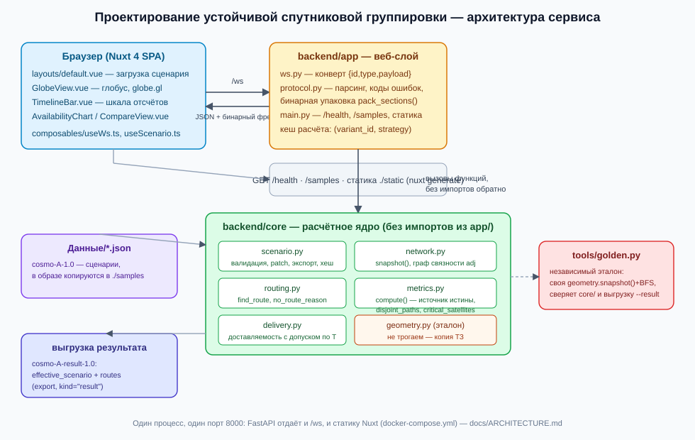

# Проектирование устойчивой спутниковой группировки

Веб-сервис для инженера-проектировщика LEO-группировки: загрузить сценарий, поменять конфигурацию
(очередь запуска, ориентацию и фазирование орбитальных плоскостей, отказы аппаратов), посчитать
покрытие и сквозные маршруты «клиентский пункт → спутники → шлюз» на суточном горизонте и сравнить
варианты по доступности, перерывам и устойчивости к отказам.

## Запуск

```
docker compose up --build
```

Открыть **http://localhost:8000** — фронтенд и `/ws` отдаются одним процессом с одного порта.
Проверка живости — `GET /health`. Если порт 8000 на вашей машине уже занят — поменяйте маппинг в
`docker-compose.yml` (`"8000:8000"` → `"<свой>:8000"`), внутри контейнера сервис всегда слушает 8000.

Собрать и запустить без `compose` (то же самое, вручную):

```
docker build -t constellation .
docker run --rm -p 8000:8000 constellation
```

### Запуск без Docker (для тех, кто правит код)

Бэкенд и фронтенд — два отдельных процесса, оба нужны для рабочего интерфейса:

```
# терминал 1 — бэкенд (FastAPI + core/numpy)
cd backend
pip install -r requirements.txt
uvicorn app.main:app --reload --port 8000

# терминал 2 — фронтенд (Nuxt dev-сервер)
cd frontend
npm install
NUXT_PUBLIC_WS_URL=ws://localhost:8000/ws NUXT_PUBLIC_API_URL=http://localhost:8000 npm run dev
```

Открыть адрес, который выведет `nuxt dev` (обычно `http://localhost:3000`). Переменные окружения
обязательны в этом режиме: фронтенд и бэкенд на разных портах — без них `useWs()` попытается
подключиться к `/ws` на порту самого фронтенда (`frontend/nuxt.config.ts`, `docs/PROTOCOL.md`,
раздел «CORS и локальная разработка»). Без правки кода можно поднять только бэкенд и работать с ним
напрямую через `/ws` (см. «Формат данных» ниже) — это уже полный расчётный цикл сервиса.

**Проверяющему:** соответствие каждому критерию оценки, с командой или кликом для самостоятельной
проверки — `docs/CRITERIA.md`.

## Боевой стенд

Сервис развёрнут на **https://braining.space**.

```bash
# пересобрать и выкатить
docker compose -f docker-compose.yml -f docker-compose.prod.yml up -d --build
```

Наложение `docker-compose.prod.yml` публикует контейнер только на петлю (`127.0.0.1:8100`) —
наружу его отдаёт nginx, он же терминирует TLS и проксирует `/ws`
(`/etc/nginx/sites-available/constellation.conf`).

Две вещи, на которых легко обжечься:

- **`up -d` без `--build` поднимает ранее собранный образ и ничего об этом не говорит.** Поэтому
  в наложении явно указан `image: constellation:latest`: что собрано, то и запущено. После выкатки
  полезно убедиться, что внутри контейнера лежит именно новая сборка:
  `docker exec constellation grep -rl "<строка из свежего кода>" /app/static/_nuxt/`
- **Контейнер слушает 8000 внутри, 8100 снаружи.** Порты 8000 и 8080 на этой машине заняты
  другими стендами.

Домен раньше занимал демо-стенд другого кейса (`cosmo_track`). Он остановлен, но не удалён —
вернуть можно так:

```bash
cd /root/project/backend && docker compose start
rm /etc/nginx/sites-enabled/constellation.conf
ln -s /etc/nginx/sites-available/cosmo-track.conf /etc/nginx/sites-enabled/cosmo-track.conf
nginx -t && systemctl reload nginx
```

Конфигурация самого сайта Braining лежит закомментированной в `braining.space.conf`, рядом её
бэкап `.bak-20260905-110904`. Поддомены `id.braining.space` и `tg.braining.space` обслуживаются
отдельными конфигами и ни разу не затрагивались.

## Что попробовать за две минуты

1. Откройте `http://localhost:8000`. Внизу сайдбара статус `/ws` меняется на «Соединение
   установлено» — WebSocket поднят сам, без действий пользователя.
2. В сайдбаре нажмите на пример `01_full_constellation.json` (список подтягивается с бэкенда,
   `GET /samples`) — можно и перетащить свой файл того же формата (`UFileUpload`). Сервер
   провалидирует сценарий сообщением `scenario.load`; в сайдбаре появится «Сценарий загружен» с
   `variant_id`, в заголовке рабочей области — тот же `variant_id` бейджем. Загрузите заведомо
   битый JSON — ошибка провалидации придёт с именем поля, а не трейсбеком (проверено
   `backend/tests/test_ws.py::test_scenario_load_validation_error_names_field`).
3. Дальше по методике приёмки ТЗ — выбрать пункт на карте, посмотреть маршрут в конкретный момент,
   переключить очередь запуска на первую и сравнить доступность, отключить спутник из текущего
   маршрута и увидеть перестроение — **это готовый контракт `/ws`, а не то, что сегодня нажимается
   мышью на этой сборке**. Экраны для всех этих действий уже написаны как отдельные компоненты
   (`GlobeView.vue`, `TimelineBar.vue`, `AvailabilityChart.vue`, `ConfigPanel.vue`,
   `CompareView.vue` — `frontend/app/components/`) и рассчитаны ровно на ответы `/ws`
   (`docs/PROTOCOL.md`), но ещё не подключены к `frontend/app/pages/index.vue` (сама страница сегодня
   показывает честные пустые состояния вместо экранов, а не имитацию данных — подробнее в
   «Ограничения» ниже). Весь расчётный цикл, который стоит за этими шагами, уже работает и
   проверяем без интерфейса — командой из следующего раздела и вручную через `/ws`
   (`docs/PROTOCOL.md` приводит реальные примеры запрос/ответ для каждого из этих действий, снятые
   с работающего сервиса).

## Возможности

По пунктам DoD, с честной пометкой, что стоит за протоколом `/ws` (проверено тестами и
`tools/golden.py`), а что — за экраном, который ещё предстоит подключить к странице:

- **Конфигурация группировки.** Очередь запуска (1/2/3), `raan_deg`/`phase_deg` плоскости, периоды
  недоступности спутников — всё это принимает и валидирует `scenario.patch` с точными границами и
  именованными ошибками (`backend/core/scenario.py::patch_scenario`, `docs/PROTOCOL.md`). Сценарии
  в сервисе неизменяемы: патч создаёт новый `variant_id`, а не правит текущий — «сохранить вариант и
  вернуться к нему» технически уже решено самим протоколом (детерминированный `variant_id =
  scenario_hash`). Форма редактирования (`ConfigPanel.vue`) реализована, но не подключена к странице.
- **Расчёт покрытия и маршрутов.** Один проход `core.metrics.compute()` на весь горизонт — доступность,
  видимость, максимальный перерыв (в т.ч. усечённый границей горизонта отдельно) по каждому пункту,
  маршрут «клиент → спутники → шлюз» на каждом отсчёте с учётом того, что клиентский пункт не
  ретранслирует. Причина отсутствия маршрута — одна из четырёх (`docs/PROTOCOL.md`, раздел «Причины
  отсутствия маршрута»): нет видимого спутника / разрыв ISL / нет контакта со шлюзом / шлюз в
  отказе. Полностью в бэкенде, покрыто тестами; отображение на карте — тот же незавершённый шаг.
- **Анализ отказов и устойчивости.** Резерв маршрутов (вершинно-непересекающиеся пути, теорема
  Менгера), критические аппараты, кратность покрытия, доставляемость с допуском по задержке —
  реализованы в `core/metrics.py`/`core/delivery.py` (`docs/EXTENSIONS.md`), числа и выводы —
  `docs/REPORT.md`. Экрана для интерактивного анализа в UI сегодня нет — воспроизводится по командам
  из `docs/REPORT.md`.
- **Сравнение вариантов.** `compare` считает оба варианта, помечает несопоставимые (различаются
  `altitude_km`/`isl_range_km`/`min_elevation_deg`/`step_s`) явным предупреждением вместо тихого
  сравнения, отдаёт дельты по каждому пункту. Экран (`CompareView.vue`) реализован отдельно от
  страницы (см. выше).
- **Данные.** Загрузка сценария того же формата `cosmo-A-1.0` (с понятными ошибками валидации) —
  единственная часть, уже работающая от кнопки в браузере до конца. Выгрузка результата
  (`cosmo-A-result-1.0`) и изменённого сценария — оба реализованы протоколом (`export`,
  `docs/PROTOCOL.md`) и проверяются `tools/golden.py --result`, кнопки сохранения файла на экране
  пока нет.

## Как устроено



Расчётное ядро (`backend/core/`) не импортирует ничего из веб-слоя и запускается отдельно от
FastAPI — оно принимает сценарий и числа, возвращает числа. `geometry.py` внутри — побайтовая копия
эталона из комплекта задачи, формулы не переписаны. Веб-слой (`backend/app/`) — тонкая обвязка:
один WebSocket-эндпоинт `/ws` (семь типов сообщений, `docs/PROTOCOL.md`) разбирает запрос, зовёт
`core/` и раскладывает результат в манифест JSON + один бинарный фрейм на весь горизонт. Фронтенд
(`frontend/`) — Nuxt 4 SPA, собирается статически (`nuxt generate`) и раздаётся тем же процессом
FastAPI из `./static` с SPA-fallback на `200.html` — один порт, один образ, никакого отдельного
веб-сервера для интерфейса. Подробности и разбор потока данных — `docs/ARCHITECTURE.md`.

## Проверка корректности

```
python3 tools/golden.py
```

Независимый эталон (свой обход `geometry.snapshot()`, без импорта `core/`) печатает доступность,
видимость и максимальный перерыв по всем сценариям `Данные/*.json`. Доступность и перерыв — это
достижимость в графе, она не зависит от алгоритма маршрутизации: расхождение с таблицей ниже — ошибка
модели, а не другой, тоже верный, подход.

| сценарий | C65 | C70 | C72 | макс. перерыв (C65/C70/C72) |
|---|---|---|---|---|
| 01 полная группировка | 96.67 % | 98.75 % | 98.89 % | 8 / 2 / 2 мин |
| 02 первая очередь | 27.22 % | 15.83 % | 12.64 % | 572 / 658 / 796 мин |
| 03 отказ 10 аппаратов | 79.31 % | 80.83 % | 82.50 % | 24 / 24 / 20 мин |
| 04 ISL 2000 км | 77.50 % | 62.22 % | 65.14 % | 94 / 178 / 4 мин |

Видимость хотя бы одного спутника на 01 и 04 почти одинакова (97.78/99.86/100 %) — доступность на 04
ниже на 20–35 п.п. при той же видимости, потому что рвётся межспутниковая сеть, а не покрытие
(`docs/REPORT.md` — разбор этого эффекта числами и командами).

Проверка выгрузки сервиса — формат `cosmo-A-result-1.0`, полнота (запись на каждую пару `(t_s,
client_id)`), физическая допустимость каждого маршрута (начинается в `client_id`, заканчивается в
шлюзе, каждое ребро существует на своём `t_s`) и сверка посчитанной по ней доступности с эталоном:

```
python3 tools/golden.py --result <файл.json>
```

`OK` — выгрузка соответствует ТЗ; иначе — список `FAIL` с причиной по каждому расхождению.

## Формат данных

Вход — сценарий `cosmo-A-1.0` (`Данные/*.json` — четыре готовых примера, копируются в образ и
доступны из интерфейса кнопкой «пример»; любой файл того же формата подойдёт, в коде и в этом
документе нет зашитых ID пунктов/плоскостей/аппаратов). Выгрузка расчёта — `cosmo-A-result-1.0`:
эффективный сценарий (с уже применёнными правками пользователя) плюс маршруты по каждой паре
`(t_s, client_id)`. Полный протокол `/ws` — все семь типов сообщений, коды ошибок, формат бинарного
пакета результата, поведение при реконнекте — **`docs/PROTOCOL.md`**, сверен построчно с
`backend/app/protocol.py`/`backend/app/ws.py` и содержит примеры запрос/ответ, снятые с реально
работающего сервиса.

## Тесты

```
cd backend && python3 -m pytest -q
```

73 теста: `test_golden.py` сверяет расчётное ядро с эталоном по всем четырём сценариям **дважды**
независимыми источниками (статическая таблица + живой запуск `tools/golden.py::metrics()`);
`test_ws.py` прогоняет весь контракт `/ws` через `TestClient` — все семь типов сообщений, все семь
кодов ошибок, побитовое совпадение бинарного пакета с манифестом, кеш по `scenario_hash`, `attach`
без пересчёта и после переподключения, устойчивость к мусору на проводе. Ни одного зашитого ID
клиента/пункта/аппарата в самих проверках — только в таблице эталонных чисел, которая явно привязана
к `Данные/`.

## Ограничения

- **Презентации нет.** Материал для защиты собран в `docs/REPORT.md`, но самого файла защиты
  в репозитории нет.
- **Автоматический подбор конфигурации не реализован** — это необязательный пункт ТЗ. Перебор
  ориентации плоскостей выполнен исследованием (`docs/PARAMETERS.md`), но в сервисе кнопки
  «подобрать» нет: параметры меняются вручную в форме.
- **Хранилище вариантов — в памяти процесса**, не файл/БД: `attach` переживает обрыв соединения, но
  не перезапуск контейнера. Это осознанный минимум под контракт (`variant_id` детерминирован по
  содержимому сценария, повторная загрузка того же по смыслу сценария не плодит копий) — см.
  `docs/ARCHITECTURE.md`, раздел «Почему кеш в памяти процесса».
- **Только геометрия, без модели радиоканала**: нет пропускной способности, задержек очередей
  передачи, помех. Доступность — «путь физически существует», а не «данные конкретного объёма
  гарантированно проходят». Полный список допущений модели, каждое с обоснованием — `docs/REPORT.md`,
  раздел «Ограничения модели».
- **Состав наземных пунктов (число и координаты шлюзов/клиентов) — не редактируется через интерфейс**,
  только через новый файл сценария того же формата. ТЗ отдаёт пользователю ровно очередь запуска,
  ориентацию/фазирование плоскостей и периоды недоступности — не список наземного сегмента.
